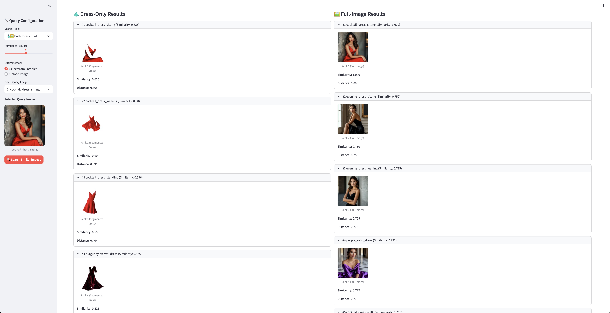

# 패션 유사도 분석 시스템

이 프로젝트는 의미론적 분할(Semantic Segmentation)이 의류 유사도 매칭을 어떻게 개선하는지 보여줍니다.

## 핵심 Workflow

### Amazon Titan Image Generator를 활용한 이미지 분할

#### 1. 마스크 생성 과정
```
원본 이미지 → Amazon Titan Image Generator → 의류 마스크 생성 → 의류 영역 추출
```

**세부 과정:**
- **입력**: 원본 패션 이미지 + 분할 프롬프트 ("dress")
- **Titan Image Generator 처리**: AI가 이미지를 분석하여 드레스 영역을 식별
- **마스크 이미지 생성**: 드레스 부분은 흰색, 배경은 검은색으로 표현된 바이너리 마스크
- 일부 이미지는 AWS 콘텐츠 필터링 정책에 따라 마스크가 추출되지 않을 수 있습니다.
- 현재 분할 프롬프트는 "dress"로 고정입니다. 필요에 따라 변경해서 사용하세요.

#### 2. 이미지 추출 및 처리

**마스크 기반 영역 추출:**
```python
# 원본 이미지에 마스크 적용
masked_image = original_image * mask + background_color * (1 - mask)
```

**처리 단계:**
1. **마스크 로딩**: PNG 형태의 바이너리 마스크 이미지 읽기
2. **알파 채널 처리**: 투명도 정보를 이용한 정확한 영역 분리
3. **배경 제거**: 드레스 영역만 남기고 나머지는 투명 또는 단색 처리
4. **이미지 저장**: 추출된 드레스 이미지를 PNG 형식으로 저장

### 임베딩 생성 및 벡터 데이터베이스

#### 1. Amazon Titan Embedding 모델
- **모델**: `amazon.titan-embed-image-v1`
- **차원**: 1024차원 벡터
- **특징**: 이미지의 시각적 특징을 고차원 벡터로 변환

#### 2. 두 가지 임베딩 방식 비교

**드레스 전용 임베딩:**
- 분할된 드레스 이미지만 사용
- 의류의 스타일, 색상, 패턴, 소재에 집중
- 포즈, 배경, 조명의 영향 최소화

**전체 이미지 임베딩:**
- 원본 이미지 전체 사용
- 포즈, 배경, 전체적인 구도 포함
- 의류 외적 요소의 영향 포함

### 유사도 검색 시스템

#### ChromaDB 벡터 데이터베이스
- **분할 저장**: 드레스 전용 DB와 전체 이미지 DB 별도 운영
- **코사인 유사도**: 벡터 간 각도 기반 유사도 측정
- **검색**: HNSW (Hierarchical Navigable Small World) 알고리즘

#### 검색 프로세스
1. **쿼리 이미지 임베딩 생성**: 입력 이미지를 1024차원 벡터로 변환
2. **벡터 유사도 계산**: 데이터베이스 내 모든 벡터와 코사인 유사도 계산
3. **결과 정렬**: 유사도 점수 기준 내림차순 정렬
4. **상위 결과 반환**: 가장 유사한 N개 결과 반환

## 사용 방법

### 1. 메인 분석 실행
```bash
python3 fashion_similarity_analysis.py
```
**수행 작업:**
- 모든 샘플 이미지 로드
- Amazon Titan을 이용한 드레스 분할
- 1024차원 임베딩 생성 (원본 + 분할 이미지)
- ChromaDB 벡터 데이터베이스 생성 및 데이터 로드
- 유사도 검색 실행 및 결과 분석
- 통계적 비교 결과 저장

### 2. Streamlit 웹 UI 실행

```bash
streamlit run fashion_similarity_ui.py
```
**접속**: http://localhost:8501

**기능:**
- **시각적 쿼리 인터페이스**: 드롭다운에서 이미지 선택 또는 업로드
- **검색 설정**: 드레스 전용/전체 이미지/양쪽 비교 선택
- **결과 개수**: 1-10개 유사 이미지 설정
- **실시간 미리보기**: 선택된 쿼리 이미지 사이드바 표시
- **비교 결과**: 드레스 전용(분할 이미지) vs 전체 이미지(원본) 나란히 표시
- **상세 정보**: 유사도 점수, 거리 값, 순위별 결과

### 3. 명령행 인터페이스 (선택사항)
```bash
python3 fashion_similarity_cli.py --query sample_images/output/dress.png both 5
```

## 핵심 결과

### 드레스 전용 검색의 장점
1. **의류 특성에 집중**: 원단, 스타일, 색상, 패턴에만 집중
2. **노이즈 제거**: 포즈, 배경, 신체 위치의 영향 최소화
3. **일관된 의류 기반 유사도**: 패션 아이템 자체의 특성으로 매칭

## 시스템 요구사항

### AWS 서비스
- **Amazon Titan Image Generator**: 이미지 분할 및 마스크 생성
- **Amazon Titan Embed Image**: 1024차원 이미지 임베딩 생성
- **적절한 IAM 권한**: Bedrock 서비스 접근 권한 필요
- **⚠️ 지역 제한**: Amazon Titan Image Generator는 **us-east-1, us-west-2** 지역에서만 사용 가능

#### Amazon Titan Image Generator 비용

| Amazon Titan 모델 | 이미지 해상도 | Standard 품질 가격 (이미지당) | Premium 품질 가격 (이미지당) |
|---|---|---|---|
| Amazon Titan Image Generator v1 | 512 x 512 미만 | $0.008 | $0.01 |
| Amazon Titan Image Generator v1 | 512 x 512 이상 | $0.01 | $0.012 |
| Amazon Titan Image Generator v2 | 512 x 512 미만 | $0.008 | $0.01 |
| Amazon Titan Image Generator v2 | 1024 x 1024 이상 | $0.01 | $0.012 |

**💡 비용 최적화 팁:**
- 본 프로젝트는 마스크 생성용으로 Standard 품질로 충분합니다

### Python 환경
- **Python 3.12+**
- **주요 라이브러리**: streamlit, chromadb, pillow, pandas, numpy
- **AWS SDK**: boto3, botocore

이 시스템은 Amazon Titan의 고급 AI 기능을 활용하여 패션 이미지의 의미론적 이해를 바탕으로 한 정확하고 실용적인 유사도 검색 데모를 보여줍니다.